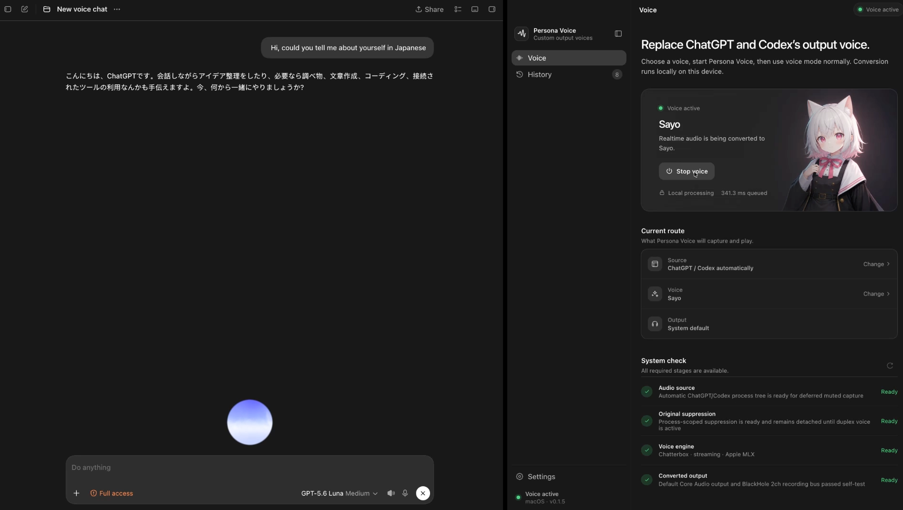
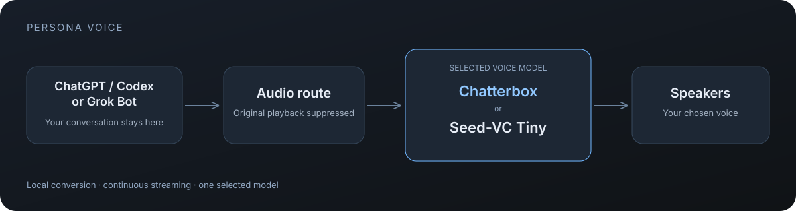

<h1 align="center">Custom output voices for ChatGPT and Codex</h1>

<p align="center">
  <strong>Persona Voice replaces assistant speech locally, with near-real-time playback.</strong>
</p>

<p align="center">
  <a href="README.md">English</a> ·
  <a href="README.zh-CN.md">简体中文</a> ·
  <a href="README.ja.md">日本語</a>
</p>

<p align="center">
  <a href="https://github.com/miuuyy/ChatGPT-Persona-Voice/actions/workflows/ci.yml"></a>
  <a href="LICENSE"></a>
  
  
  
</p>

<p align="center">
  
</p>

<p align="center">
  
</p>

Persona Voice replaces the spoken output of ChatGPT and Codex with a voice you choose. The
conversation and controls remain in the source app, while conversion runs locally on your device.
Output quality and timing vary with the hardware, source audio, and selected reference.

## Voice models

Download one model during first-run setup, then add the other later in **Settings → Voice model**.
Existing installations keep their current model; new Apple Silicon installs recommend Chatterbox.

| Model | Released | Speech and performance |
| --- | --- | --- |
| Seed-VC Tiny | 2024 | Best suited to Japanese and Chinese in our comparisons; 300 ms streaming blocks. Apple Silicon and x64 NVIDIA CUDA. |
| Chatterbox | 2025 | Recommended for English and other languages; English live-tested. 640 ms streaming blocks on Apple Silicon. |

On the same English recording, Chatterbox took 29% less processing time on our Apple M4 Pro.
Quality varies by language and voice. See [model comparison and sources](docs/VOICE_MODELS.md)
for measurements, startup delay, storage requirements, and availability.

## Why Persona Voice

- **Near-real-time conversion.** Both models process speech in bounded blocks and
  streams converted audio as it becomes available. Actual latency varies by hardware and route.
- **The original voice is replaced, not layered.** Persona Voice suppresses the selected app's
  original playback and sends the converted voice to your speakers.
- **Local inference.** Once installed, conversion runs on your device. No voice API key is required.
- **Voice presets and local references.** The included catalog contains credited VOICEVOX
  identities and a small set of community/demo references. You can also add an authorized private
  reference of your own.
- **Personalisation.** Pick a bundled identity or pair an authorized reference with its own
  character scene.
- **Private history controls.** History is off by default. If enabled, only converted output can be
  stored, with six-hour cleanup by default and an immediate clear action.

## How it works

```text
ChatGPT / Codex app
        │ voice output
        ▼
Persona Voice audio route
        ▼
Selected local model: Chatterbox / Seed-VC
        │
        ▼
Speakers
```

Persona Voice waits until the selected app, local engine, and output route are ready before replacing
the original playback. If the route cannot be established safely, conversion does not start.

Read the full [architecture](docs/ARCHITECTURE.md), [native protocol](docs/NATIVE_PROTOCOL.md),
and [engine contract](docs/ENGINE_CONTRACT.md).

## Demo

https://github.com/user-attachments/assets/f43f9f90-a76f-4984-b061-145aa7db5467

## Quick start

### Download and use

Download the latest macOS, Windows, or Linux build from [Releases](https://github.com/miuuyy/ChatGPT-Persona-Voice/releases/latest).
Windows setup links to the official [VB-CABLE](https://vb-audio.com/Cable/) download; install it
separately, restart Windows, and follow the in-app Volume Mixer step.

1. Launch Persona Voice, choose and download one voice model, and complete system-audio setup.
2. Open ChatGPT or Codex, then choose the source app and target voice in Persona Voice.
3. Press **Start voice**, then enter voice mode in ChatGPT or Codex.

See [Platform status](#platform-status) for requirements and
[Troubleshooting](docs/TROUBLESHOOTING.md) if setup is blocked.

### Run from source

Requirements:

- Git, Bun 1.3.14, Node.js 22.12+, and [`uv`](https://docs.astral.sh/uv/);
- one qualified host profile: Apple Silicon macOS 14.2+ with MPS/MLX, x64 Linux with a supported
  NVIDIA CUDA driver, or x64 Windows build 20348+ with a supported NVIDIA CUDA driver;
- the platform native toolchain: Xcode Command Line Tools on macOS, a C++20 compiler plus
  `pkg-config`/PipeWire development headers on Linux, or MSVC/CMake/Windows SDK on Windows;
- Chatterbox space (macOS): approximately 4 GiB installed, 8 GiB free for setup. Seed-VC space:
  2.5 GiB / 6 GiB free on macOS, 9 GiB / 15 GiB free on Windows, 11 GiB / 15 GiB free on Linux.
- Windows also requires the official VB-CABLE driver, installed separately from VB-Audio.

```bash
git clone --recurse-submodules https://github.com/miuuyy/ChatGPT-Persona-Voice.git
cd ChatGPT-Persona-Voice
bun install --frozen-lockfile
bun run dev
```

Linux source runs also require PipeWire and WirePlumber. See [Development](docs/DEVELOPMENT.md) for
platform setup, native build commands, and contributor verification.

## Platform status

| Platform | Availability | Requirements and current limits |
| --- | --- | --- |
| Apple Silicon macOS 14.2+ | Preview package available | MPS/MLX; production signing/notarization and clean-machine qualification remain |
| Linux x64 + NVIDIA | Preview package available | CUDA 13.0, PipeWire, and WirePlumber; broader distribution coverage remains |
| Windows x64 + NVIDIA, build 20348+ | Preview package available | CUDA 13.0 and separately installed VB-CABLE; physical-host feedback is welcome |
| Other hosts | Unavailable | Unsupported |

See the detailed
[platform matrix](docs/PLATFORM_MATRIX.md) and [release gates](docs/RELEASE.md).

## Voice references

The bundled catalog currently includes Shikoku Metan, Zundamon, Kasukabe Tsumugi, Meimei Himari,
Kyushu Sora, WhiteCUL, Ouka Miko, Sayo, Haruka Nana, Nekotsuka Aru, Manbetsu
Hanamaru, Kotoyomi Nia, a community JARVIS reference, and an unaffiliated Donald Trump demo
likeness.

VOICEVOX samples are assembled from official showcase audio and retain their required credit.
Community and public-figure references retain their own terms and must never be presented as
authentic speech or endorsement. Use only voices you are authorized to use. See the
[voice manifest](voices/manifest.json) and the single
[third-party notice inventory](THIRD_PARTY_NOTICES.md).

## Safety and privacy

- Raw captured PCM is not intentionally persisted or logged.
- History accepts only converted frames submitted to the output session.
- Voice replacement starts only after the local engine and audio route are ready.
- Settings, logs, models, references, and optional history remain in local workspace/application
  storage during use.
- On macOS, BlackHole and OBS are separate trust boundaries. When using the converted-only recording bus,
  mute audio from OBS macOS Screen Capture or it will record the original system stream as well.

Read [Privacy](docs/PRIVACY.md), [Security](SECURITY.md), and
[Troubleshooting](docs/TROUBLESHOOTING.md) before using sensitive audio.

## Development

```bash
bun run test
bun run typecheck
bun run build:renderer
bun run check
bun run smoke:engine
```

| Document | Contents |
| --- | --- |
| [Development](docs/DEVELOPMENT.md) | Setup, checks, native smokes, and contribution workflow |
| [Architecture](docs/ARCHITECTURE.md) | Process boundaries, lifecycle, queues, and persistence |
| [Platform matrix](docs/PLATFORM_MATRIX.md) | Implemented paths and remaining release gates |
| [Native protocol](docs/NATIVE_PROTOCOL.md) | CPV1 framing and bounded audio transport |
| [Engine contract](docs/ENGINE_CONTRACT.md) | CPVE lifecycle and Seed-VC profile |
| [Model adapters](docs/MODEL_ADAPTERS.md) | Rules for integrating another conversion backend |
| [Release engineering](docs/RELEASE.md) | Artifact policy, signing, and publication gates |

## Contributing and license

Contributions are welcome within the current experimental scope. Start with
[CONTRIBUTING.md](CONTRIBUTING.md) and follow the [Code of Conduct](CODE_OF_CONDUCT.md).

Original launcher code is available under the [MIT License](LICENSE). Seed-VC remains GPL-3.0,
and model files, voice references, and dependencies retain their own licenses and terms. See
[Third-party notices](THIRD_PARTY_NOTICES.md).

## Disclaimer

Codex Persona Voice is independent software and is not affiliated with or endorsed by OpenAI.
ChatGPT, Codex, and the OpenAI mark belong to OpenAI. This project does not bypass authentication,
subscriptions, permissions, or access controls.
